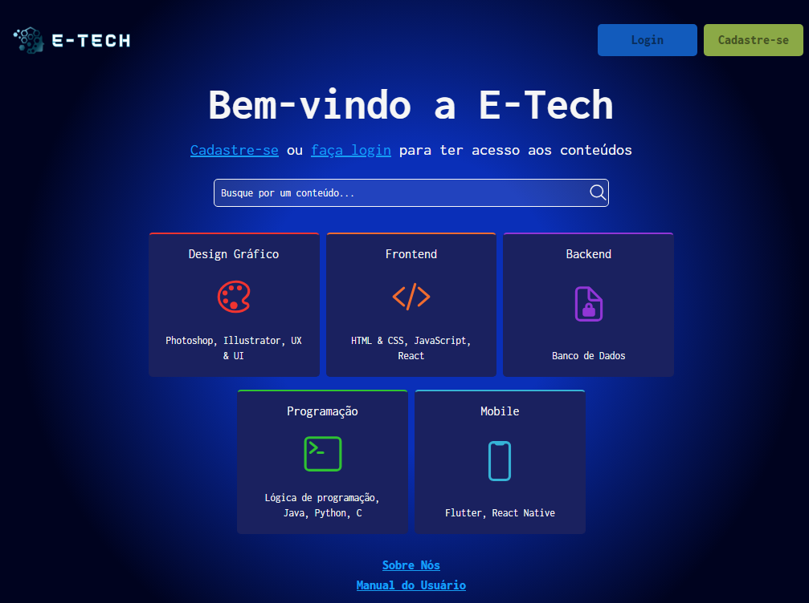
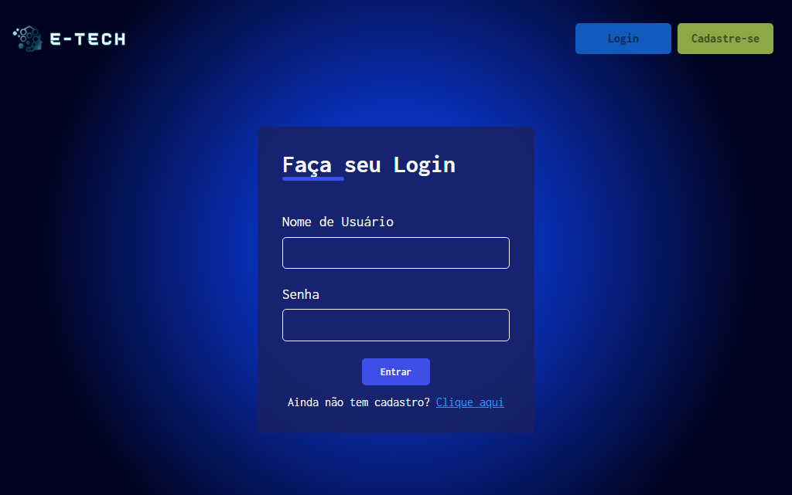
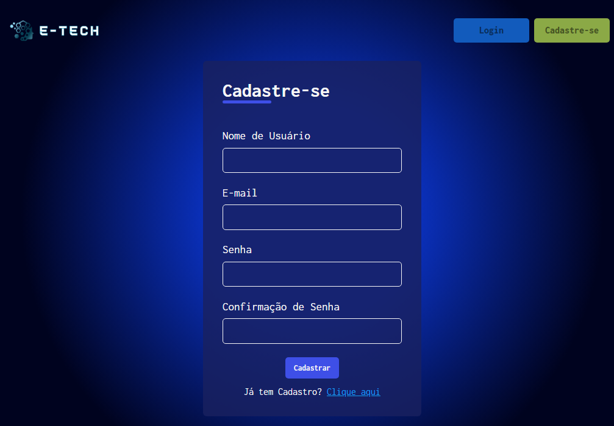
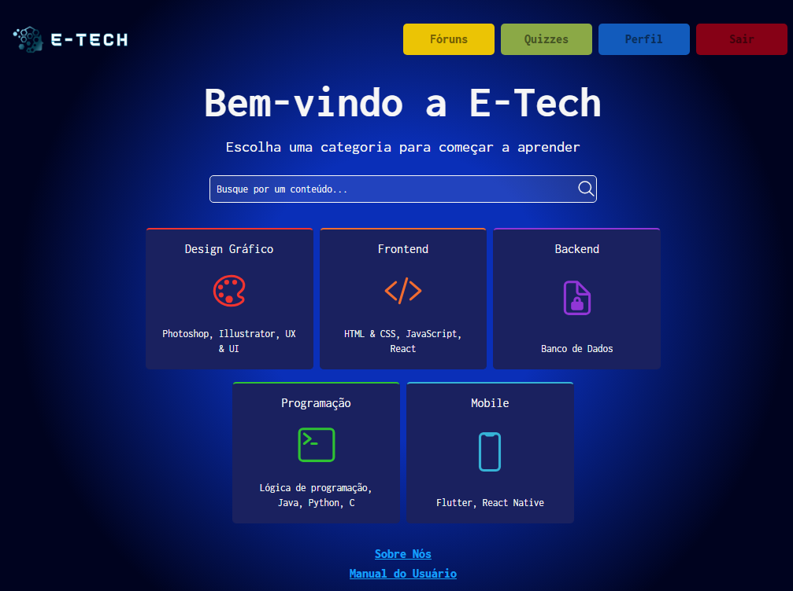
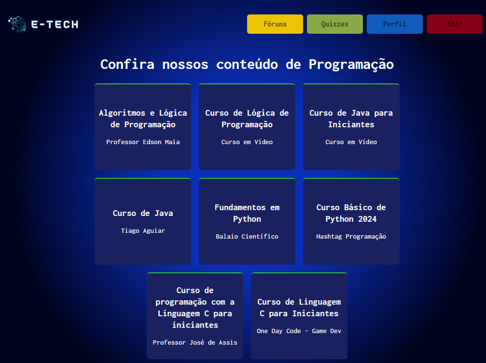
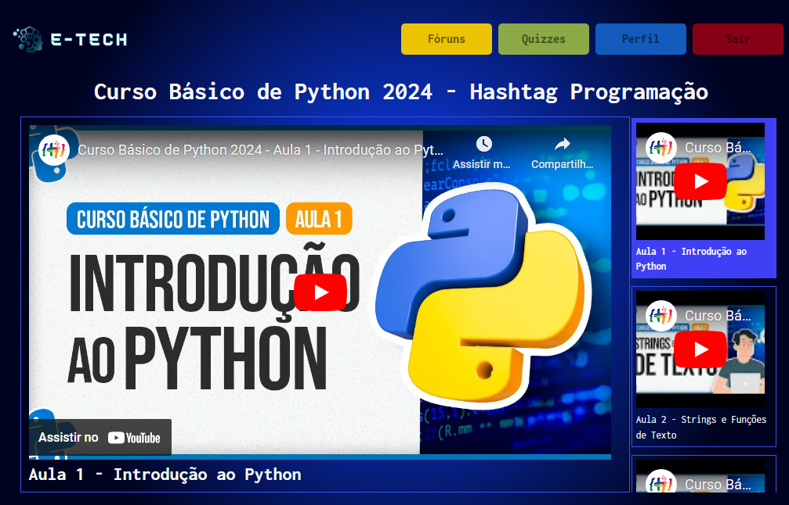
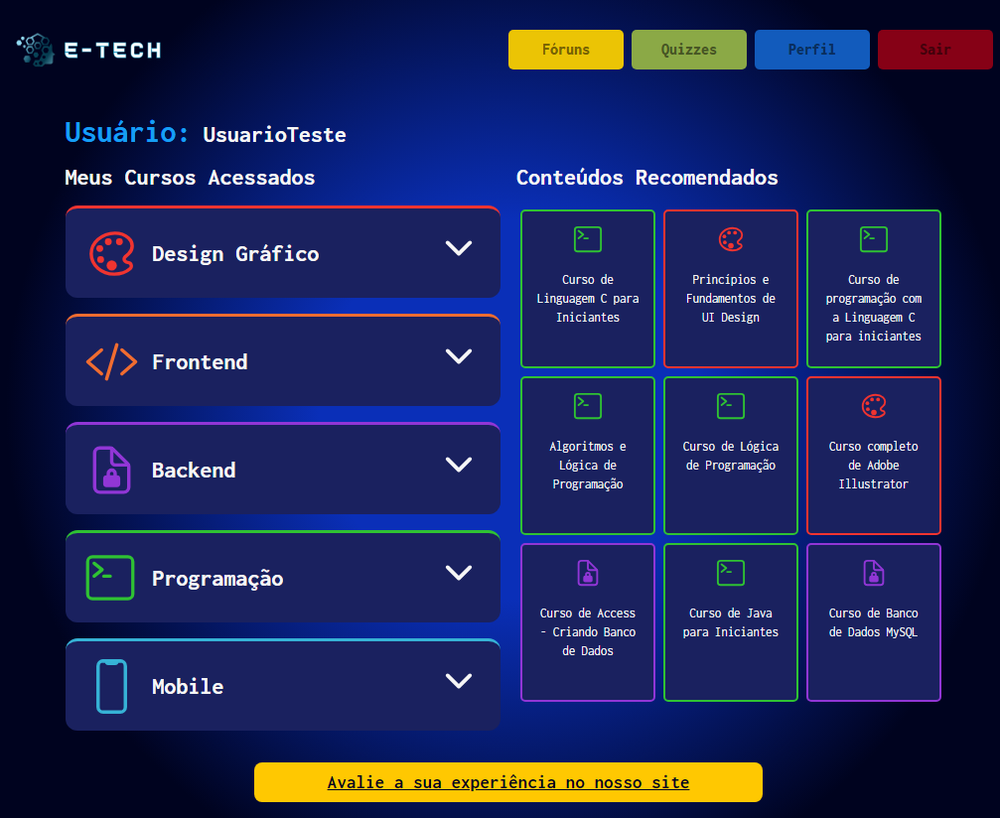
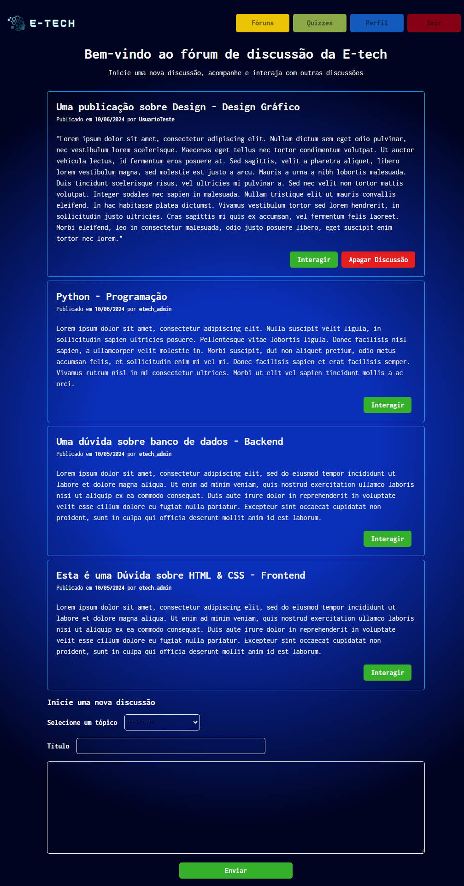

# E-tech 

Uma plataforma que reúne e disponibiliza conteúdos sobre tecnologia.

## Conteúdo

- [Visão Geral](#visão-geral)
  - [O projeto](#o-projeto)
  - [A plataforma](#a-plataforma)
- [Meu processo de criação](#meu-processo)
  - [Construído com](#construído-com)
- [Autores](#autora)

## Visão Geral

A e-tech é um projeto cujo o objetivo foi criar uma plataforma que reunísse em um único lugar conteúdos, principalmente em vídeos, sobre tecnologia.

Foi construída inteiramente com [Django(Python)](https://docs.djangoproject.com/pt-br/4.2/).

### O projeto

É uma plataforma completa onde os usuários podem criar contas, fazer login, acompanhar coneúdos, interagir entre si em fóruns de discussões, ter um histórico de conteúdos acessados e uma lista de recomendações personalizada.

Ao entrar na plataforma o usuário vê uma tela inicial com a opção de fazer login e/ou criar uma conta. Ao fazer login, o usuário é redirecionado para a mesma tela inicial onde agora possui outras opções, como acessar o fórum de discussões, uma tela de perfil, quizzes e os conteúdos de fato.

A plataforma contém um sistema salva os conteúdos acessados pelo usuário e os exibe a tela de perfil. Com os conteúdos acessados salvos, uma lista de recomendação (também na tela de perfil do usuário) baseada nos acessos do usuário é exibida.

### A plataforma

Aqui estão algumas das telas da plataforma e suas funcionalidades:

**Homepage:** tela inicial ao entrar no site, possui algumas informações, as opções para fazer login ou para criar uma conta e a lista de conteúdos disponíveis

**Login:** tela que permite que o usuário faça login na plataforma

**Criação de conta:** tela que permite que o usuário crie uma conta nova na plataforma, caso ainda não possua uma conta

**Tela de início após o login:** após o login do usuário, ele ganha algumas outras opções que são:
- Barra de navegação com:
  - fóruns
  - quizzes
  - perfil
  - botão para fazer o logout

**Detalhes do conteúdo:** ao esolher um conteúdo entre os disponíveis (Design, Frontend, Backend, Programação, Mobile) para aprender, o usuário pode acessar uma playlist específica (vinda do YouTube)

**Exibição da playlist:** ao escolher uma das playlists para assistir, o usuário poderá acompanhá-la diretamente pela plataforma

**Tela de Perfil:** na esquerda, o histórico de acesso separado por categorias, e na direita as recomendações para o usuário.

**Fórum de discussões:** onde os usuários podem interagir entre si clicando no botão "Interagir". E criar novas discussões preenchendo os campos no final da tela.

## O Processo de criação

### Construído com

Como dito anteriormente, este projeto foi inteiramente construído com [Django](https://docs.djangoproject.com/pt-br/4.2/), framework do python. 

O Django é um framework que permitem a construção de um projeto bastante completo, a criação de uma base de dados de forma bastante simples e um gerenciamento da base de dados bastante tranquila, visto que a página administraiva do Django é muito intuitiva. 

## Autores

O projeto foi criado e desenvolvido por cinco desenvolvedores iniciantes: Alessandra (eu), Ana Júlia, André Luiz, Felipe Rasera e Rafael Rasera

Alessandra Oliveira:
- [Github](https://github.com/itsale-o)
- [LinkedIn](https://www.linkedin.com/in/alessandra-santos-oliveira/)
- [Twitter](https://twitter.com/itsale_o)

Rafael Rasera:
- [Github](https://github.com/RafaelRasera)

